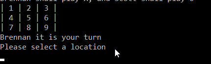

# Lab04-TicTacToe
- **Summary**
    - This application is a virtual Tic Tac Toe board. The screen even displays the board and progress for you.
    Two players get 9 turns to get three of their markers, X and O respectively, in a row. The program will either 
    crown a winner or declare a draw.

- **Steps**
    - Input names for players 1 and 2. Player 1 is assigned X, Player 2 is assigned O

    

    - The program will display a representation of the board with numbers for each location

    

    - Choose  a location, and the program change that location to your marker, X or O

    

    - Game will continue until one player wins or it is a draw

    

      